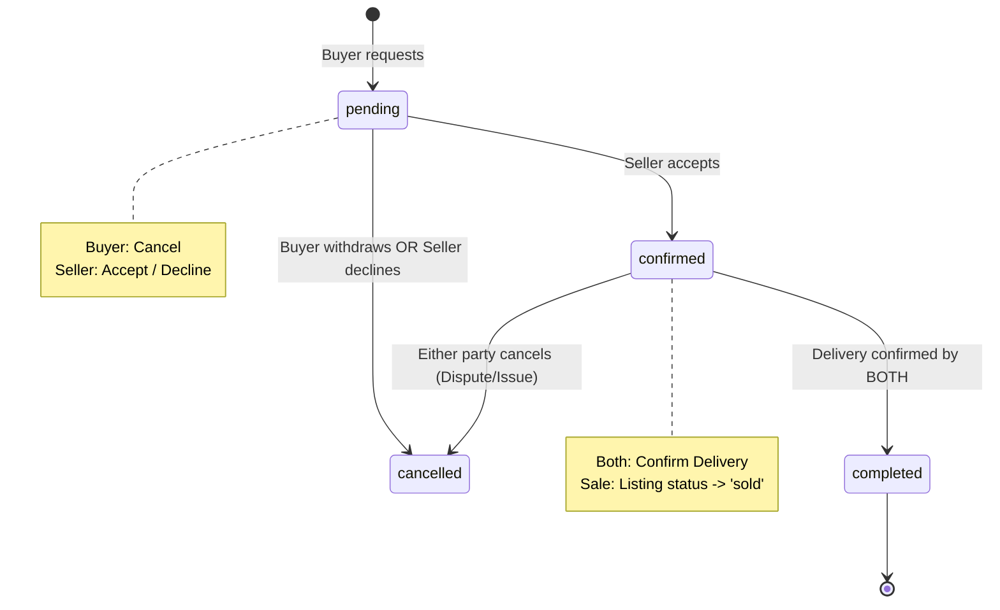

# Orders Feature Integration Analysis

## Task 1: Status Report

| File | Data Source | Existing Logic / Methods | Missing Fields / Issues |
| :--- | :--- | :--- | :--- |
| `lib/data/models/order.dart` | Real (Supabase) | `fromJson`, `toJson` | Matches DB schema well. Uses `DateTime?` for `returnConfirmedAt` to track timing. |
| `lib/data/repositories/order_repository.dart` | Real (Supabase) | `createOrder`, `fetchOrders`, `fetchOrder`, `updateOrderStatus` | Complete repository structure. `fetchOrders` handles both buyer and seller roles via `.or()`. |
| `lib/features/orders/providers/orders_provider.dart` | **Mock** | `OrdersTab` state, `orders` provider returning mock lists. | **CRITICAL**: Contains a local `Order` class that conflicts with `lib/data/models/order.dart`. |
| `lib/features/orders/screens/orders_screen.dart` | Mock State | Tabbed view (Buying vs Selling), Sectioned lists (Action Needed, Active, History). | Wired to `ordersProvider` (Mock). |

---

## Task 2: Schema Mapping Analysis

### Orders Table (`orders`)

| DB Column | Dart Field | Match Status | Notes |
| :--- | :--- | :--- | :--- |
| `id` (uuid) | `String id` | ✅ Match | |
| `listing_id` (uuid) | `String listingId` | ✅ Match | |
| `buyer_id` (uuid) | `String buyerId` | ✅ Match | |
| `seller_id` (uuid) | `String sellerId` | ✅ Match | |
| `order_type` (text) | `String orderType` | ✅ Match | 'sale' or 'rental'. |
| `status` (text) | `String status` | ✅ Match | pending, confirmed, completed, cancelled. |
| `rental_start_date` | `DateTime? rentalStartDate` | ✅ Match | |
| `rental_end_date` | `DateTime? rentalEndDate` | ✅ Match | |
| `return_confirmed_at`| `DateTime? returnConfirmedAt`| ✅ Match | |
| `total_price` | `double totalPrice` | ✅ Match | |
| `delivery_confirmed_by_buyer`| `bool deliveryConfirmedByBuyer`| ✅ Match | |
| `delivery_confirmed_by_seller`| `bool deliveryConfirmedBySeller`| ✅ Match | |
| `delivery_photo_url` | `String? deliveryPhotoUrl` | ✅ Match | |
| `delivery_note` | `String? deliveryNote` | ✅ Match | |
| `transaction_snapshot_url`| `String? transactionSnapshotUrl`| ✅ Match | |
| `school` (text) | **MISSING** | ❌ Missing | Add `String school` to model. |
| `created_at` | `DateTime createdAt` | ✅ Match | |
| `updated_at` | `DateTime updatedAt` | ✅ Match | |

---

## Task 3: Query Pattern Inventory

1.  **List User Orders**: `OrderRepository.fetchOrders(userId)`
    *   **Joins**: Needs `listings(title, category)` and `user_profiles(display_name)` (counterparty).
    *   **Logic**: Filter locally or via separate repository methods into "Buying" and "Selling" based on `buyer_id` vs `seller_id`.

2.  **Order Detail**: `OrderRepository.fetchOrder(id)`
    *   **Joins**: `listings(*)`, `user_profiles!buyer(*), user_profiles!seller(*)`.

3.  **Place Order**: `OrderRepository.createOrder(order)`
    *   Triggered from `ListingDetailScreen`.

4.  **Update Status**: `OrderRepository.updateOrderStatus(id, status)`
    *   Used for Confirm, Cancel, etc.

---

## Task 4: Provider Refactor Draft

```dart
// lib/features/orders/providers/orders_provider.dart

@riverpod
class OrdersList extends _$OrdersList {
  @override
  Future<List<Order>> build() async {
    final user = ref.watch(currentUserProvider); // Get auth state
    if (user == null) return [];
    
    final tab = ref.watch(ordersTabProvider);
    final allOrders = await ref.watch(orderRepositoryProvider).fetchOrders(user.id);
    
    // Filter based on tab
    if (tab == OrderTab.buying) {
      return allOrders.where((o) => o.buyerId == user.id).toList();
    } else {
      return allOrders.where((o) => o.sellerId == user.id).toList();
    }
  }
}
```

---

## Task 5: Dependencies and Imports Check

- `supabase_flutter`: ✅
- `riverpod`: ✅
- `freezed`: ✅
- Conflict Check: Must remove the local `Order` class in `orders_provider.dart` and use the domain model from `lib/data/models/order.dart`.

---

## Task 6: Known Risks

1.  **Status Sync Latency**: When a seller confirms an order, the buyer's UI might not update immediately without a Realtime subscription or manual refresh.
2.  **Concurrency**: If both parties try to update the order status simultaneously (e.g. both clicking "Confirm Delivery"), Postgres RLS and `updated_at` checks must ensure consistency.
3.  **Snapshot Validity**: `transaction_snapshot_url` stores the state of the listing at the time of purchase. If the listing is edited later, the order must still point to the old data (or the snapshot).

---

## Task 7: State Machine Diagram



| Transition | Initiator | Required Fields | Side Effects |
| :--- | :--- | :--- | :--- |
| `pending -> confirmed` | Seller | `status = 'confirmed'` | None |
| `pending -> cancelled` | Either | `status = 'cancelled'` | None |
| `confirmed -> completed`| **Both** | `delivery_confirmed_by_buyer = true`, `delivery_confirmed_by_seller = true` | **Sale**: listing.status = 'sold' |
| `confirmed -> cancelled`| Either | `status = 'cancelled'` | None |

---

## Task 8: Rental vs Sale Logic

### Data Handling
-   **Sale**: Simple transaction. Total price is static.
-   **Rental**: Requires `rental_start_date` and `rental_end_date`. Total price calculated based on duration and rate (daily/weekly/monthly).

### Completion States
-   **Sale**: Ends at `completed` status.
-   **Rental**: Reaches `completed` when the item is **returned**. We need an extra sub-state or field:
    *   `status == 'completed'` means delivery happened.
    *   `return_confirmed_at != null` means the rental cycle is truly finished.

---

## Task 9: Listing Status Sync

### Logic Draft
**Recommendation: Use Database Triggers (Edge Logic) for consistency.**

```sql
-- Pseudocode for Trigger
CREATE TRIGGER sync_listing_status
AFTER UPDATE ON public.orders
FOR EACH ROW
WHEN (NEW.status = 'completed')
BEGIN
  IF (NEW.order_type = 'sale') THEN
    UPDATE public.listings SET status = 'sold' WHERE id = NEW.listing_id;
  ELSIF (NEW.order_type = 'rental') THEN
    -- Keep active for next renter
    UPDATE public.listings SET status = 'active' WHERE id = NEW.listing_id;
  END IF;
END;
```

**Alternative (Application Logic)**:
Inside `OrderRepository.updateOrderStatus`, if the status becomes `completed`, also call `ListingRepository.updateListingStatus`.
*   **Risk**: If the app crashes between the two calls, the listing stays 'active' even if sold. **Triggers are safer.**
