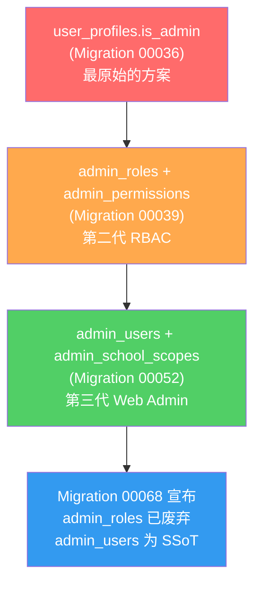
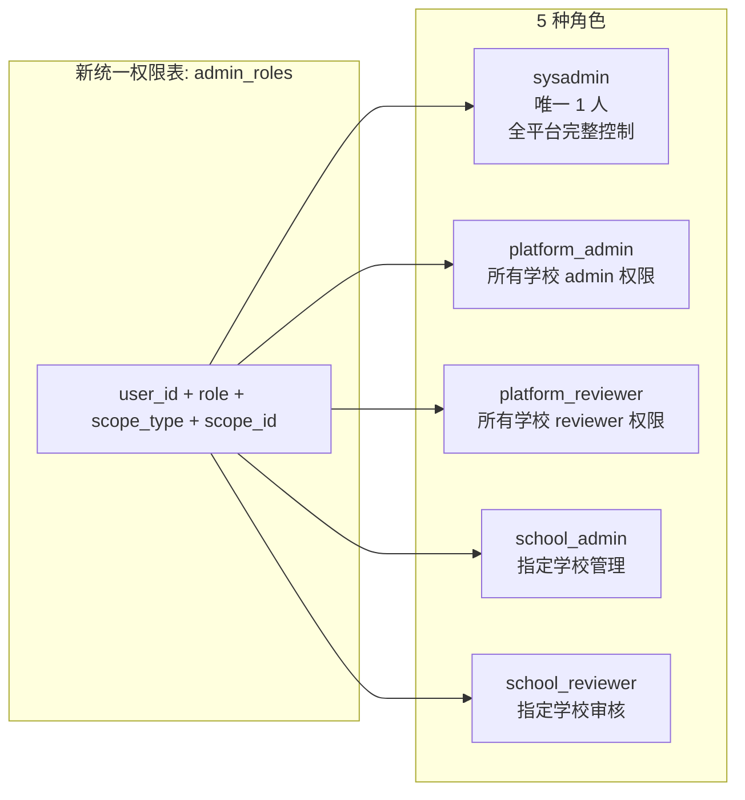

# Smivo 权限体系迁移方案

## 一、现状调查报告

### 1.1 现有权限体系的三层架构（历史遗留）

目前 Smivo 的管理员权限分散在 **三个互不关联的系统** 中，这是多次迭代叠加的结果：



| 层 | 表/字段 | 创建时间 | 当前状态 | 谁在用？ |
|---|---|---|---|---|
| **第一层** | `user_profiles.is_admin` | Migration 00036 | ❌ 已过时但仍有 RLS 依赖 | 部分旧 RLS 策略 |
| **第二层** | `admin_roles` + `admin_permissions` | Migration 00039 | ⚠️ 被标记废弃但 **Flutter App 仍在使用** | Flutter App 的整个 Admin 模块 |
| **第三层** | `admin_users` + `admin_school_scopes` | Migration 00052 | ✅ 当前 Web Admin 的主力 | React Admin Dashboard |

> [!CAUTION]
> **核心问题：Flutter App 和 React Admin Dashboard 分别读取不同的权限表！**
> - Flutter App → 读 `admin_roles` 表（已被标记废弃）
> - React Admin → 读 `admin_users` 表
> - 这意味着在一个平台上修改权限，另一个平台看不到变化。

---

### 1.2 所有权限相关组件的完整清单

#### 1.2.1 数据库层（Database）

| 组件 | 文件/位置 | 功能 | 迁移影响 |
|---|---|---|---|
| `user_profiles.is_admin` | 00036 | 布尔标记，最早期的管理员判定 | 🔴 **删除** |
| `admin_roles` 表 | 00039 | 三级角色（operator/admin/sysadmin）+ 作用域 | 🔴 **删除** → 用新表替代 |
| `admin_permissions` 表 | 00039 | 按模块的权限覆盖（role_id → module → permission） | 🔴 **删除** → 简化权限模型 |
| `admin_users` 表 | 00052 | Web Admin 登录表，5 级角色 | 🟡 **改造** → 重命名/重构为新 `admin_roles` |
| `admin_school_scopes` 表 | 00052 | 管理员可管理的学校列表 | 🔴 **删除** → 合并进新 `admin_roles` |
| `is_platform_sysadmin()` | 00040→00068 | 查 `admin_users` 判断是否 sysadmin | 🟡 **重写** → 查新表 |
| `is_admin_user()` | 00052 | 查 `admin_users` 判断是否任意管理员 | 🟡 **重写** → 查新表 |
| `check_admin_permission()` | 00039→00067 | 查 `admin_roles` 做模块级权限判定 | 🔴 **删除** → 由新函数替代 |
| `admin_has_college_access()` | 00052→00068 | 查 `admin_school_scopes` | 🔴 **删除** → 由新函数替代 |
| `handle_new_user()` trigger | 00097 | 注册时写 `admin_users` | 🟡 **修改** → 写新表 |

##### 依赖 `is_platform_sysadmin()` 的 RLS/RPC（30+ 处）

| 使用位置 | Migration |
|---|---|
| `admin_users` FOR ALL 策略 | 00069 |
| `admin_school_scopes` FOR ALL 策略 | 00069 |
| `system_settings` FOR ALL 策略 | 00069 |
| `schools` FOR ALL 策略 | 00069 |
| `moderation_drafts` 策略 | 00069 |
| `clear_platform_test_data()` | 00067→00084→00085→00087→00088 |
| `clear_school_test_data()` | 00067→00083→00084 |
| `admin_delete_user()` | 00079→00080 |
| `admin_create_user()` Edge Function | 00081 |
| `system_configs` 策略 | 00057 |
| `listing_moderation_notices` 策略 | 00071 |
| `image_moderation_logs` 策略 | 00090 |
| `pickup_locations` 默认值 RPC | 00091 |

##### 依赖 `is_admin_user()` 的 RLS 策略

| 使用位置 | Migration |
|---|---|
| `moderation_queue` FOR SELECT | 00094 |
| `moderation_tasks` FOR ALL | 00101 |

##### 依赖 `admin_users` 直接查询的 RLS 策略

| 使用位置 | Migration |
|---|---|
| `school_categories` FOR SELECT + FOR ALL | 00092 |
| `school_conditions` FOR SELECT + FOR ALL | 00092 |
| `pickup_locations` FOR SELECT + FOR ALL | 00092 |

#### 1.2.2 Flutter App 层

| 组件 | 文件 | 读取的表 | 迁移影响 |
|---|---|---|---|
| `AdminRole` model | `app/lib/data/models/admin_role.dart` | `admin_roles` | 🔴 **重写** |
| `AdminPermission` model | `app/lib/data/models/admin_permission.dart` | `admin_permissions` | 🔴 **删除** |
| `AdminRoleRepository` | `app/lib/data/repositories/admin_role_repository.dart` | `admin_roles` + `admin_permissions` | 🔴 **重写** |
| `AdminContext` class | `app/lib/features/admin/providers/admin_auth_provider.dart` | 通过 Repository 读 `admin_roles` | 🟡 **重写** |
| `adminContextProvider` | 同上 | 同上 | 🟡 **重写** |
| Admin Shell Screen | `admin_shell_screen.dart` | 通过 `adminContextProvider` | 无需改（自动跟随 provider） |
| Admin Roles Screen | `admin_roles_screen.dart` | 直接操作 `admin_roles` CRUD | 🟡 **适配新表** |
| System Settings | `system_settings_screen.dart` | `adminContextProvider.isSysadmin` | 无需改 |
| 8 个 Admin Feature Screen | `admin_*_screen.dart` | 通过 `adminContextProvider` | 无需改 |

#### 1.2.3 React Admin Dashboard 层

| 组件 | 文件 | 读取的表 | 迁移影响 |
|---|---|---|---|
| `useAuth` hook | `admin/src/hooks/useAuth.ts` | `admin_users` + `admin_school_scopes` | 🟡 **重写** |
| `useAdmins` hook | `admin/src/hooks/useAdmins.ts` | `admin_users` + `admin_school_scopes` | 🟡 **重写** |
| `useUsers` hook | `admin/src/hooks/useUsers.ts` | JOIN `admin_users` + `admin_school_scopes` | 🟡 **修改 JOIN** |
| Auth Store | `admin/src/stores/auth-store.ts` | 存储 `AdminUser` + `AdminSchoolScope` | 🟡 **适配新类型** |
| School Scope Store | `admin/src/stores/school-scope-store.ts` | 基于 scopes 切换学校 | 🟡 **适配新查询** |
| Admin Types | `admin/src/types/admin-user.ts` | 类型定义 | 🟡 **重写** |
| Constants | `admin/src/lib/constants.ts` | `TABLES.ADMIN_USERS`, `TABLES.ADMIN_SCHOOL_SCOPES` | 🟡 **修改** |
| `UsersPage.tsx` | `admin/src/pages/users/UsersPage.tsx` | 引用 `is_admin` 字段 | 🟡 **修改** |
| `UserDetailPage.tsx` | `admin/src/pages/users/UserDetailPage.tsx` | 引用 `is_admin` 字段 | 🟡 **修改** |

#### 1.2.4 Edge Functions

| 函数 | 文件 | 依赖 | 迁移影响 |
|---|---|---|---|
| `admin-create-user` | `supabase/functions/admin-create-user/index.ts` | `is_platform_sysadmin()` RPC + 写 `admin_users` | 🟡 **改为写新表** |
| `broadcast-announcement` | `supabase/functions/broadcast-announcement/index.ts` | 调用 `is_sysadmin` RPC | 🟡 **确认 RPC 名** |

---

## 二、新权限体系设计

### 2.1 目标架构



### 2.2 新 `admin_roles` 表结构

```sql
CREATE TABLE public.admin_roles (
  id          uuid PRIMARY KEY DEFAULT gen_random_uuid(),
  user_id     uuid NOT NULL REFERENCES user_profiles(id) ON DELETE CASCADE,
  role        text NOT NULL,
  scope_type  text NOT NULL,  -- 'platform' or 'school'
  scope_id    uuid,           -- NULL for platform, school UUID for school
  is_active   boolean NOT NULL DEFAULT true,
  created_at  timestamptz NOT NULL DEFAULT now(),
  updated_at  timestamptz NOT NULL DEFAULT now(),

  CONSTRAINT admin_roles_role_check
    CHECK (role IN ('sysadmin', 'platform_admin', 'platform_reviewer',
                    'school_admin', 'school_reviewer')),

  CONSTRAINT admin_roles_scope_check
    CHECK (scope_type IN ('platform', 'school')),

  CONSTRAINT admin_roles_scope_logic
    CHECK (
      (scope_type = 'platform' AND scope_id IS NULL) OR
      (scope_type = 'school' AND scope_id IS NOT NULL)
    ),

  -- 同一用户、同一角色、同一作用域只能有一条记录
  CONSTRAINT admin_roles_unique
    UNIQUE (user_id, role, scope_type, scope_id)
);
```

### 2.3 角色与权限矩阵

| 操作 | school_reviewer | school_admin | platform_reviewer | platform_admin | sysadmin |
|---|:---:|:---:|:---:|:---:|:---:|
| 审核商品违规 | ✅ 本校 | ✅ 本校 | ✅ 全校 | ✅ 全校 | ✅ |
| 处理用户反馈 | ✅ 本校 | ✅ 本校 | ✅ 全校 | ✅ 全校 | ✅ |
| 处理用户举报 | ✅ 本校 | ✅ 本校 | ✅ 全校 | ✅ 全校 | ✅ |
| 惩罚用户（非冻结） | ✅ 本校 | ✅ 本校 | ✅ 全校 | ✅ 全校 | ✅ |
| 冻结用户 | ❌ | ✅ 本校 | ❌ | ✅ 全校 | ✅ |
| 维护商品类型/成色/自提点 | ❌ | ✅ 本校 | ❌ | ✅ 全校 | ✅ |
| Sensitive Words 维护 | ❌ | ✅ | ❌ | ✅ | ✅ |
| Push Notification | ❌ | ✅ | ❌ | ✅ | ✅ |
| Data Dashboard | ❌ | ✅ | ❌ | ✅ | ✅ |
| 管理管理员权限 | ❌ | ❌ | ❌ | ❌ | ✅ |
| 管理学校配置 | ❌ | ❌ | ❌ | ❌ | ✅ |

### 2.4 业务规则（数据库层强制执行）

1. **sysadmin 唯一性**：`admin_roles` 中 `role = 'sysadmin'` 的记录最多只能有 **1 条**。用 TRIGGER 或 CONSTRAINT 强制。
2. **平台角色自动清理**：
   - 授予 `platform_admin` 时 → 自动删除该用户所有 `school_admin` 记录
   - 授予 `platform_reviewer` 时 → 自动删除该用户所有 `school_reviewer` 记录
3. **一个管理员可以有多条记录**：例如同时是 smivo.io 的 `school_reviewer` + Smith College 的 `school_admin`。
4. **每个管理员必须属于一个学校**：这通过 `user_profiles.school_id` 保证，不影响权限表。

---

## 三、迁移计划（分 5 步）

### Step 1：创建新 `admin_roles` 表 + 迁移数据

```
输入: 旧 admin_users + admin_school_scopes 数据
输出: 新 admin_roles 表已填充
```

| 子步骤 | 操作 |
|---|---|
| 1a | `DROP TABLE admin_roles CASCADE`（删除旧的已废弃的 admin_roles） |
| 1b | `DROP TABLE admin_permissions CASCADE`（删除旧的权限覆盖表） |
| 1c | 创建新 `admin_roles` 表（结构见 §2.2） |
| 1d | 从 `admin_users` 迁移数据到新表 |
| 1e | 从 `admin_school_scopes` 迁移 school scope 数据 |
| 1f | 添加 sysadmin 唯一性触发器 |
| 1g | 添加平台角色自动清理触发器 |

**数据迁移映射**：

```
admin_users (role = 'sysadmin')
  → admin_roles (role='sysadmin', scope_type='platform', scope_id=NULL)

admin_users (role = 'platform_admin')
  → admin_roles (role='platform_admin', scope_type='platform', scope_id=NULL)

admin_users (role = 'platform_reviewer')
  → admin_roles (role='platform_reviewer', scope_type='platform', scope_id=NULL)

admin_users (role = 'school_admin') + admin_school_scopes
  → admin_roles (role='school_admin', scope_type='school', scope_id=每个 college_id)

admin_users (role = 'school_reviewer') + admin_school_scopes
  → admin_roles (role='school_reviewer', scope_type='school', scope_id=每个 college_id)
```

### Step 2：重写数据库函数 + RLS 策略

| 子步骤 | 操作 |
|---|---|
| 2a | 重写 `is_platform_sysadmin()` → 查新 `admin_roles` |
| 2b | 重写 `is_admin_user()` → 查新 `admin_roles` |
| 2c | 创建新 `has_admin_role(role, scope_id)` 辅助函数 |
| 2d | 删除 `check_admin_permission()` 函数 |
| 2e | 删除 `admin_has_college_access()` 函数 |
| 2f | 重写所有直接查 `admin_users` 的 RLS 策略（约 12 条） |
| 2g | 重写 `handle_new_user()` 触发器 → 写新 `admin_roles` |
| 2h | `ALTER TABLE user_profiles DROP COLUMN is_admin` |
| 2i | `DROP TABLE admin_users CASCADE` |
| 2j | `DROP TABLE admin_school_scopes CASCADE` |

### Step 3：适配 Flutter App

| 子步骤 | 文件 | 操作 |
|---|---|---|
| 3a | `admin_role.dart` | 重写 model，保持字段名与新表一致 |
| 3b | 删除 `admin_permission.dart` + 生成文件 | 不再需要权限覆盖 |
| 3c | `admin_role_repository.dart` | 重写，改为查新 `admin_roles`（FROM 表名不变） |
| 3d | `admin_auth_provider.dart` | 重写 `AdminContext`，删除 `_overrides`；`isSysadmin` 改为查 `role == 'sysadmin'` |
| 3e | `admin_roles_screen.dart` | 适配新表结构的 CRUD |
| 3f | 运行 `build_runner` | 重新生成 freezed/g.dart |

### Step 4：适配 React Admin Dashboard

| 子步骤 | 文件 | 操作 |
|---|---|---|
| 4a | `constants.ts` | 删除 `ADMIN_USERS`、`ADMIN_SCHOOL_SCOPES`，改为 `ADMIN_ROLES: 'admin_roles'` |
| 4b | `admin-user.ts` | 重写类型定义 |
| 4c | `useAuth.ts` | 改为查 `admin_roles` 表 |
| 4d | `useAdmins.ts` | 完全重写，适配新表 |
| 4e | `useUsers.ts` | 修改 JOIN 语句 |
| 4f | `auth-store.ts` | 适配新类型 |
| 4g | `school-scope-store.ts` | 通过查新表获取可管理的学校列表 |
| 4h | `UsersPage.tsx` + `UserDetailPage.tsx` | 移除 `is_admin` 引用 |

### Step 5：Edge Functions 适配

| 子步骤 | 文件 | 操作 |
|---|---|---|
| 5a | `admin-create-user/index.ts` | 将写入 `admin_users` 改为写入新 `admin_roles` |
| 5b | `broadcast-announcement/index.ts` | 确认 `is_sysadmin` RPC 是否存在，修正调用 |

---

## 四、风险评估

### 🔴 高风险

| 风险 | 影响 | 缓解措施 |
|---|---|---|
| **RLS 策略引用旧表** — 超过 30 条 RLS 策略通过 `is_platform_sysadmin()` 或 `is_admin_user()` 间接依赖权限表 | 如果函数指向的表被删除，**所有管理操作都会被 RLS 拦截** | 先重写函数 → 再删旧表，顺序不能反 |
| **Flutter 和 React 同时在线** — 迁移期间两个客户端可能读到不同状态 | 短暂的权限判断失败 | 将整个迁移打包在一个 SQL 事务中 |
| **sysadmin 丢失** — 如果迁移逻辑错误，唯一的超级管理员记录可能丢失 | 完全丧失管理权限，无法恢复 | 迁移脚本中先 SELECT 验证后再 DROP |

### 🟡 中风险

| 风险 | 影响 | 缓解措施 |
|---|---|---|
| **表名冲突** — 新表也叫 `admin_roles`，和旧的同名 | DROP CASCADE 可能影响外键 | 先 DROP 旧表 → 再 CREATE 新表 |
| **admin_permissions 的外键** — `admin_permissions.role_id` 引用旧 `admin_roles.id` | DROP CASCADE 会一起删除 | 这是预期行为（我们要删除权限覆盖） |
| **Edge Function 缓存** — Supabase Edge Functions 可能缓存旧的查询结果 | 短暂的权限异常 | 迁移后手动触发 NOTIFY pgrst, 'reload schema' |

### 🟢 低风险

| 风险 | 影响 | 缓解措施 |
|---|---|---|
| **文档过时** — `docs/admin大纲/` 中引用旧表名 | 仅影响开发者参考 | 迁移后更新文档 |
| **admin/rpcs.txt** 过时 | 仅是参考文件 | 重新 dump |

---

## 五、回滚策略

1. **Git 备份已完成**：`5f26b1b` — 可随时 `git reset --hard` 恢复代码
2. **数据库回滚**：迁移 SQL 中包含一个"数据快照"步骤，将旧表数据导出到临时表
3. **Supabase Dashboard**：如果紧急情况，可直接在 Supabase SQL Editor 中手动重建旧表

---

## 六、执行清单（等待确认）

- [ ] Step 1：创建新表 + 数据迁移（SQL Migration）
- [ ] Step 2：重写 DB 函数 + RLS（SQL Migration 同一文件）
- [ ] Step 3：Flutter App 适配
- [ ] Step 4：React Admin Dashboard 适配
- [ ] Step 5：Edge Functions 适配
- [ ] Step 6：运行 `flutter analyze` + `npm run build` 验证
- [ ] Step 7：推送 GitHub
