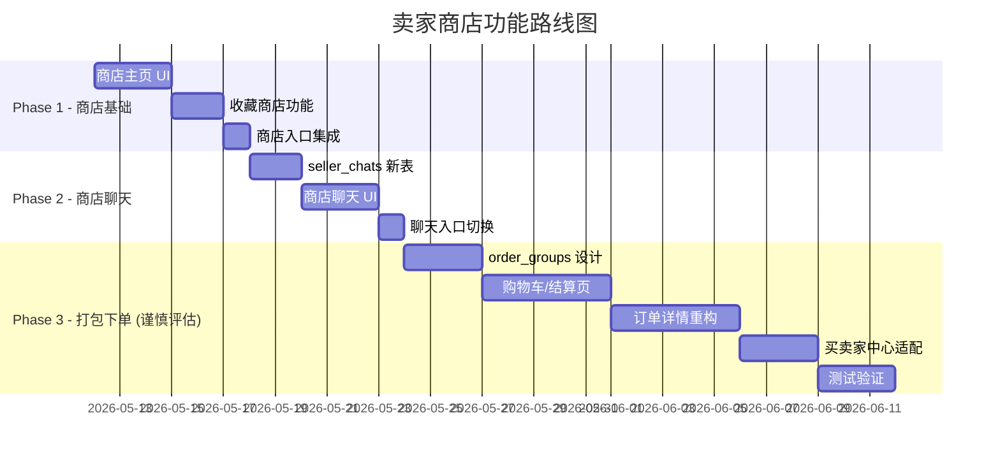

# 卖家商店 (Seller Shop) 功能可行性分析

## 一、需求理解

参考拼多多截图，核心诉求是给每个卖家一个"商店主页"：
- 📄 **商店首页**：展示卖家头像/评分/关注数/商品列表，支持筛选排序
- ⭐ **收藏商店**：收藏卖家本人（而非单个商品）
- 🛒 **多商品打包下单**：选多个商品一起提交一个订单
- 💬 **按卖家聊天**：一个买家对一个卖家只有一个会话（不再按商品拆分）

---

## 二、当前架构核心约束

### 2.1 订单模型 — **1 Order ↔ 1 Listing**

```sql
-- orders 表
listing_id uuid NOT NULL REFERENCES listings(id)  -- 强制 1:1
order_type text CHECK (order_type IN ('sale','rental'))
```

当前每个 Order 只绑定一个 `listing_id`。所有业务逻辑（接受/拒绝竞争报价、配送确认、
租赁状态机、押金退还、证据照片）都基于这个 1:1 关系。

**影响**: 多商品打包下单需要引入"订单组"或"子订单"概念。

### 2.2 聊天模型 — **1 ChatRoom ↔ 1 Listing**

```sql
-- chat_rooms 表
listing_id uuid NOT NULL REFERENCES listings(id)
UNIQUE (listing_id, buyer_id, seller_id)  -- 三元组唯一
```

当前每个 ChatRoom 绑定一个商品。消息、未读计数、ChatPopup 里的商品预览
都依赖这个绑定关系。

**影响**: 按卖家聊天需要把 `listing_id` 从"必填"改成"可空"，或者创建新的
seller-level 会话表。

### 2.3 接受逻辑 — **`accept_order_and_reject_others` RPC**

```sql
-- 接受一个 offer 时，原子性地将同一 listing 的其他 pending orders 设为 missed
UPDATE orders SET status = 'missed'
WHERE listing_id = p_listing_id AND status = 'pending' AND id != p_order_id;
```

这个逻辑假设"一个商品同时只能有一个 confirmed 的买家"。如果改成打包下单，
一个订单包含多个商品，竞争逻辑需要扩展到按 listing 级别锁定。

### 2.4 收藏模型 — **saved_listings (user ↔ listing)**

```sql
UNIQUE (user_id, listing_id)  -- 只能收藏商品
```

收藏商店需要新表 `saved_sellers` (user_id, seller_id)。

---

## 三、各模块改造评估

### 🟢 简单 — 商店主页 + 收藏商店

| 项目 | 工作量 | 说明 |
|------|--------|------|
| 商店主页 UI | 中 | 新建 `seller_shop_screen.dart`，查询 `listings.where(seller_id=X, status=active)` |
| 卖家信息区 | 小 | 复用 `SmivoUserIdentity`，加关注按钮和统计数据 |
| 商品列表 | 小 | 复用现有 `ListingCard` 组件 + 分类/排序 |
| 收藏商店 DB | 小 | 新建 `saved_sellers` 表 + RLS |
| 收藏商店 UI | 小 | 新增 `SavedSeller` model + provider + 列表页 |
| 路由 | 小 | 新增 `AppRoutes.sellerShop` |

> **结论**: 商店主页和收藏商店是**低风险增量功能**，不触及现有核心逻辑。
> 可以先独立上线。

---

### 🟡 中等复杂 — 按卖家聊天

当前聊天架构的核心问题：

```
现在: ChatRoom = (listing_id, buyer_id, seller_id)  — 按商品建会话
目标: ChatRoom = (buyer_id, seller_id)               — 按卖家建会话
```

#### 方案 A：改造现有 chat_rooms（推荐）

1. `listing_id` 改为 `nullable`
2. 新增 `context_type` 字段 (`'listing' | 'seller'`)
3. 修改唯一约束：`UNIQUE (buyer_id, seller_id)` + 废弃旧的三元组约束
4. `ChatPopup` 不再依赖 listing 预览（改为显示"来自 XX 的商店"）
5. 聊天列表的 listing 预览改为卖家商店信息

**受影响的文件（至少 15 个）：**

| 层 | 文件 | 改动 |
|----|------|------|
| Model | `chat_room.dart` | `listingId` 改为可空 |
| Model | `chat_room.freezed.dart` | 重新生成 |
| Model | `chat_listing_preview.dart` | 可能废弃或改为可空 |
| Repo | `chat_repository.dart` | `getOrCreateChatRoom` 签名变化 |
| Provider | `chat_provider.dart` | `ChatConversation` 适配无 listing 场景 |
| UI | `chat_list_screen.dart` | 列表项显示卖家名而非商品名 |
| UI | `chat_list_item.dart` | 适配无商品预览 |
| UI | `chat_room_screen.dart` | AppBar 显示卖家信息 |
| UI | `chat_popup.dart` | 移除强制 listing 信息 |
| UI | `listing_detail_screen.dart` | 消息按钮改为按卖家开聊 |
| UI | `list_order_card.dart` | 聊天按钮适配 |
| UI | `order_info_section.dart` | 聊天按钮适配 |
| UI | `transaction_management_screen.dart` | 3 处 showChatPopup 调用 |
| DB | Migration | ALTER chat_rooms, 更新 RLS, 更新 UNIQUE |
| Edge Function | `order-accepted-message` | 使用新的会话查找逻辑 |

**数据迁移风险**: 已有的 chat_rooms 数据需要合并（同一对 buyer-seller 
可能因为不同 listing 有多个 chat room），消息历史需要合并或保留索引。

#### 方案 B：双轨并行（过渡方案）

保留现有 per-listing 聊天不动，新增 `seller_chats` 表用于商店级聊天。
两套聊天入口共存：商品详情页用旧的，商店页用新的。

- 优点：零风险，不碰已有数据
- 缺点：用户体验割裂，长期维护成本高

#### 我的建议

**Phase 1 先做方案 B**（双轨），同时在 UI 上引导用户使用商店聊天。
**Phase 2 再迁移方案 A**，合并历史数据。

---

### 🔴 高复杂度 — 多商品打包下单

这是改动最大、风险最高的模块。

#### 当前 Order 结构的限制

```
Order.listing_id    → 1 个商品
Order.total_price   → 1 个价格
Order.order_type    → sale 或 rental（但打包后可能混合）
Order.rental_*      → 租赁日期绑定单商品
```

#### 架构设计方案

```
┌─────────────────────────────┐
│         order_groups        │ ← 新表：打包订单组
│  id, buyer_id, seller_id   │
│  total_price, status        │
│  created_at                 │
└──────────┬──────────────────┘
           │ 1:N
┌──────────▼──────────────────┐
│         orders (现有表)      │ ← 作为"子订单/行项目"
│  order_group_id (nullable)  │ ← 新增外键
│  listing_id, order_type     │
│  total_price (单项)          │
└─────────────────────────────┘
```

#### 受影响的核心业务流程

| 流程 | 当前逻辑 | 打包后的新逻辑 | 复杂度 |
|------|----------|--------------|--------|
| **下单** | 1 listing → 1 order | 多 listing → 1 group + N orders | 🔴 高 |
| **接受** | accept 1 order → reject others for same listing | 需要逐 listing 检查竞争 | 🔴 高 |
| **配送确认** | 单商品双方确认 | 每个子订单独立确认？还是整组？| 🔴 高 |
| **取消** | cancel 1 order | 部分取消？整组取消？| 🔴 高 |
| **租赁** | 单商品租赁周期 | 打包里租赁+购买混合？| 🔴 极高 |
| **价格计算** | total_price = listing.price | sum(子订单) + 可能的折扣 | 🟡 中 |
| **Timeline** | 单订单时间线 | 组级时间线 + 子订单时间线 | 🔴 高 |
| **证据照片** | 按 order 上传 | 按 order_group? 按子订单？| 🟡 中 |
| **通知** | 按 order 触发 | 合并通知？逐子订单通知？| 🟡 中 |
| **订单详情页** | 展示 1 个商品 | 展示 N 个商品 + 各自状态 | 🔴 高 |
| **Buyer Center** | 按 order 展示 | 按 group 展示 + 展开子订单 | 🔴 高 |
| **Seller Center** | 按 order 展示 | 按 group 展示？| 🔴 高 |

#### 数据库改动

```sql
-- 新表
CREATE TABLE order_groups (
  id uuid PRIMARY KEY DEFAULT gen_random_uuid(),
  buyer_id uuid NOT NULL REFERENCES user_profiles(id),
  seller_id uuid NOT NULL REFERENCES user_profiles(id),
  status text NOT NULL DEFAULT 'pending',
  total_price numeric(10,2) NOT NULL,
  created_at timestamptz NOT NULL DEFAULT now(),
  updated_at timestamptz NOT NULL DEFAULT now()
);

-- 修改现有表
ALTER TABLE orders ADD COLUMN order_group_id uuid REFERENCES order_groups(id);
```

#### 需要修改的 RPC 函数

- `accept_order_and_reject_others` → 改为按 group 接受
- `cancel_pending_orders_on_delist` → 需要处理 group 内部分取消
- `notify_order_status_change` → 通知逻辑需要识别 group

#### 需要修改的 App 文件（至少 25+ 个）

| 范围 | 文件数 | 说明 |
|------|--------|------|
| Models | 3+ | 新增 OrderGroup, 修改 Order |
| Repositories | 2+ | 新增 OrderGroupRepository, 修改 OrderRepository |
| Providers | 4+ | orders_provider, buyer/seller center providers |
| Screens | 8+ | 订单详情(sale+rental), buyer/seller center, 结算页 |
| Widgets | 6+ | order cards, timeline, evidence, chat history |
| DB Migrations | 3+ | 新表 + 修改 RPC + 修改触发器 |
| Edge Functions | 2+ | 通知, 自动消息 |

---

## 四、推荐实施路线



### Phase 1：商店基础 ✅ 低风险

- 新建商店主页 + 收藏商店
- 不修改任何现有代码
- 可独立上线，2-3 天

### Phase 2：商店聊天 🟡 中风险

- 双轨方案，新增 seller_chats 表
- 商店页用新聊天，商品页保留旧聊天
- 3-5 天

### Phase 3：多商品打包下单 🔴 高风险

- 需要引入 order_groups 概念
- 涉及 25+ 文件修改
- 租赁 + 购买混合场景极复杂
- 建议 **先限制只支持同类型（都是 sale）的打包**
- 10-15 天

---

## 五、我的核心建议

> [!IMPORTANT]
> **多商品打包下单** 会根本性改变订单架构，对 Smivo 当前以 "一物一交易" 
> 为核心的业务模型影响极大。建议在 Phase 1+2 上线后，根据真实用户数据
> 评估是否有足够需求再决定是否实施 Phase 3。

> [!TIP]
> **替代方案**: 如果打包下单是为了方便买家，可以考虑更轻量的 "购物车提醒" 
> 功能 — 买家在商店页勾选多个商品后，系统自动发一条聊天消息给卖家说
> "我对这 3 件商品感兴趣"，然后仍然按单商品分别下单。这样改动量 < 5 个文件。

你想先从哪个 Phase 开始？或者需要我对某个模块深入分析？
